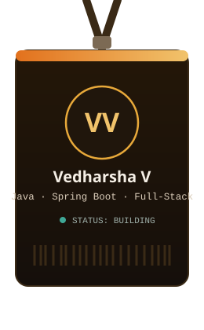

  

  

 

## ☕ About Me

I'm a Computer Science Engineer passionate about building **scalable backend systems, full-stack applications, and intelligent software solutions**.

I primarily work with **Java, Spring Boot, REST APIs, PostgreSQL, and MySQL**, while also exploring **React, Machine Learning, and Computer Vision**.

I enjoy turning real-world problems into practical software solutions and continuously improving my problem-solving skills through coding and hands-on development.

 

## 🛠️ Tech Stack

 

## 📊 GitHub Stats &amp; Graphs

 

 

 

> Every hex code above (`150F0B`, `F1C36B`, `E2711D`, `3FA796`) is the same coffee/amber palette used in the banner and badge — that's what makes a profile look designed instead of "default template." Swap `Vedharsha` for your exact username if needed.

 

## 🐍 Watch the Snake Eat My Contributions

> Needs a one-time GitHub Action in your `Vedharsha` repo (instructions below) — say the word and I'll generate the exact workflow file colored to match, so the snake itself is amber instead of the default green.

 

## 🧩 Problem Solving

### 🟧 LeetCode

 

### 🎮 CodinGame

  

<table>
<tr>
<td align="center" width="150">🧠 LEVEL <b>edit me</b></td>
<td align="center" width="150">⚡ XP <b>edit me</b></td>
<td align="center" width="150">🏅 RANK <b>edit me</b></td>
<td align="center" width="150">🌐 LANGUAGE <b>Java</b></td>
</tr>
</table>

 

> CodinGame has no public stats API (unlike LeetCode), so this table is filled in by hand rather than fetched live.

 

## 🏆 Achievements

<table>
<tr>
<td align="center" width="200">🏆 <b>1st Place</b> Code Forge</td>
<td align="center" width="200">🥈🥉 <b>Silver &amp; Bronze</b> Java — CodinGame</td>
<td align="center" width="200">🏅 <b>Finalist</b> Uyir Road Safety Hackathon 2K25</td>
</tr>
<tr>
<td align="center">🥉 <b>3rd Prize</b> Paper Presentation</td>
<td align="center">🎤 <b>Top 20</b> Moonlight Talkshop</td>
<td align="center">💻 <b>Problem Solver</b> Competitive Programming</td>
</tr>
</table>

 

## 📜 Certifications

- ☕ **Advanced Diploma in Java Programming** — CSC
- 🌐 **Web Application Development** — XPlore IT Corp.
- ☁️ **AWS Cloud Practitioner**
- 📊 **Data Analytics with Python** — NPTEL
- 🤖 **Introduction to Machine Learning** — NPTEL
- 🍃 **Introduction to MongoDB for Students**
- 🟨 **JavaScript** — Udemy

 

## 📫 Let's Connect

  

<i>⭐️ Always learning, always building. ☕</i>

